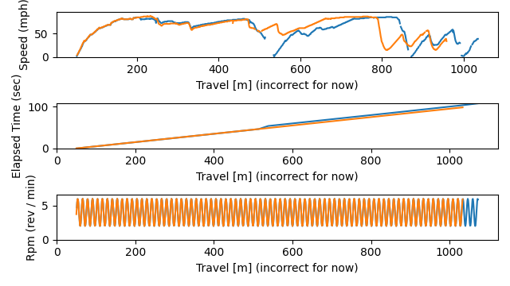

# Telemetry for Art of Rally

Not affiliated with the Art of Rally game

This repository hosts Python tools to process a video recording of an Art of
Rally game and turn it into an automated telemetry system.

The telemetry is inspired by Formula 1 telemetry plotting speed along various
points in the track. My hope is to recreate this type of telemetry (speed vs
track position) in a visual style that complements the Art of Rally game style.

## Gameplay

Screenshot from Art of Rally game showing model car driving 82 mph

Key Elements / Features:
- [x] Elapsed Time (top right)
- [ ] Progress along the track (left hand side)
- [ ] Speed (bottom center, left)
- [ ] Gear (bottom center, center)
- [ ] Engine RPM (bottom center, right)

Over time, these features will be automatically parsed from gameplay imagery
and used to create telemetry timeseries.

## Telemetry

Example prototype telemetry plot based on the data in `data/lake_nakaru_r/001/`

